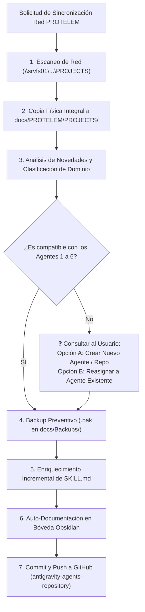

---
name: sincronizacion-red-protelem
description: Protocolo automatizado para escanear, copiar físicamente e integrar dinámicamente todos los archivos y proyectos guardados en la carpeta de red \\srvfs01\ProyectoTelemedicion\Documentación\PROTELEM\PROJECTS hacia docs/PROTELEM/PROJECTS/ dentro de antigravity-agents-repository, generando backups preventivos .bak y enriqueciendo las habilidades de los agentes sin perder nada de información.
---

# Habilidad: Protocolo de Sincronización Dinámica y Copia Física Red PROTELEM (`sincronizacion-red-protelem`)

Esta habilidad define el **protocolo operativo estandarizado** para copiar físicamente todos los archivos y actualizar el conocimiento y las habilidades del ecosistema de agentes cada vez que se agreguen o modifiquen proyectos en la carpeta de red:
`\\srvfs01\ProyectoTelemedicion\Documentación\PROTELEM\PROJECTS`

---

## 🔄 Flujo de Ejecución del Protocolo

---

## 📋 Pasos Detallados del Protocolo

### 1. Escaneo de Red e Identificación de Novedades
- Ejecutar lectura recursiva sobre `\\srvfs01\ProyectoTelemedicion\Documentación\PROTELEM\PROJECTS`.
- Identificar carpetas o notas creadas, modificadas o ampliadas por el equipo.

### 2. Copia Física Integral de Archivos (Fisica Mirroring)
- **REGLA MANDATORIA**: Copiar físicamente el 100% de las carpetas y archivos desde la red hacia la carpeta interna del repositorio:
  `D:\Proyectos\antigravity-agents-repository\docs\PROTELEM\PROJECTS\`
- Garantizar que **ningún archivo, nota o configuración sea omitido o reemplazado sintéticamente**.

### 3. Clasificación de Dominio por Agente Especialista
Mapear cada novedad identificada según el perfil del agente correspondiente:
- **`ciencia-de-datos`**: Tablas Oracle `XXSIGEC`, reglas de negocio para reportes BI (`normativa-epec`), archivos QVD Qlik Sense, motores Text-to-SQL, ETLs y pipelines de datos.
- **`asesor-legal-financiero`**: Modificaciones al Reglamento de Comercialización EPEC, régimen legal de ilícitos, recupero de energía, contratos de servicios públicos y servidumbres.
- **`desarrollador-web-showroom`**: Nuevas convenciones de publicación de reportes técnicos HTML estáticos, visualización web de informes o tableros estáticos.
- **`arquitecto-sistemas-epec`**: Nuevos pliegos, anexos, 929 requerimientos CIS/MDM/WFM/CRM, evaluación de proveedores (Oracle C2M/CCS, OPEN, PRETECO/ESC) o arquitectura empresarial.
- **`analista-financiero`**: Evaluaciones económico-financieras de tarifas, modelos de costos o flujo de fondos de proyectos EPEC.

> [!CAUTION]
> **Regla de Compatibilidad y Consulta**:
> Si se descubre un nuevo proyecto o cuerpo documental en la red que **NO sea compatible** con los agentes 1 a 6 creados, **DETENER** la actualización e interrogar al usuario para elegir entre:
> - *Opción A*: Crear un nuevo perfil de agente (`.agents/skills/<nuevo-agente>/SKILL.md`) y/o repositorio dedicado.
> - *Opción B*: Autorizar la asignación del nuevo tema a un agente existente.

### 4. Generación de Backups Preventivos (`docs/Backups/`)
- **REGLA OBLIGATORIA**: Antes de aplicar cualquier cambio en un archivo `.agents/skills/<agente>/SKILL.md`, crear una copia de respaldo en:
  `docs/Backups/YYYY-MM-DD_HHmmss_<nombre-agente>_SKILL.md.bak`

### 5. Enriquecimiento Incremental de Habilidades
- Editar `.agents/skills/<agente>/SKILL.md` incorporando los nuevos conocimientos, patrones o reglas descubiertos.
- Mantener intacta la estructura obligatoria de **Metodología en 6 Etapas**.

### 6. Auto-Documentación en Bóveda Obsidian
- Actualizar la nota compendio `docs/Proyectos/2026-09-02_protelem-conocimiento-integrado.md`.
- Registrar la entrada histórica en `docs/Historial-Mejoras/YYYY-MM-DD_protelem_sincronizacion_<proyecto>.md`.
- Actualizar los diagramas relacionales y enlaces en `docs/00-Dashboard-MOC.md`.

### 7. Sincronización Remota en GitHub
- Ejecutar en `D:\Proyectos\antigravity-agents-repository`:
  `git add .`
  `git commit -m "docs(protelem): copia fisica e integracion dinamica de conocimiento red srvfs01"`
  `git push origin master`
