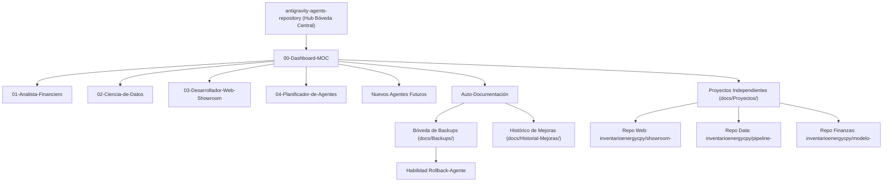

# 🧠 Bóveda de Agentes Antigravity IDE - Map of Content (MOC)

Bienvenido a la Bóveda de Obsidian para la gestión estructurada de agentes con habilidades avanzadas, **soporte para nuevos perfiles futuros**, **historial de evoluciones** y **sistema de resguardo/rollback preventivo**.

---

## 📌 Datos del Entorno
- **Cuenta GitHub**: `inventarioenergycpy`
- **Correo Electrónico**: `inventario.energycpy@gmail.com`
- **Modo de Autenticación**: Inicio directo con Google OAuth.
- **Protocolo de Desarrollo**: **Metodología Estandarizada en 6 Etapas** aplicada al 100% de las habilidades (`Investigación en Fuentes Confiables -> Diseño & Tesis -> Pruebas Parciales -> Prueba Piloto con Aprobación -> Pruebas Finales -> Auto-Documentación & Bóveda Obsidian`).

---

## 🤖 Arquitectura del Sistema de Agentes y Repositorios Dedicados

---

## 📂 Áreas de la Bóveda Obsidian

### 1. [[Agentes/01-Analista-Financiero|Analista Financiero]]
- **Entregables**: Google Drive (`inventario.energycpy@gmail.com`) / Repositorios Financieros Dedicados.

### 2. [[Agentes/02-Ciencia-de-Datos|Ciencia de Datos]]
- **Entregables**: Carpetas locales `%USERPROFILE%\Downloads` / Repositorios de Datos Dedicados.

### 3. [[Agentes/03-Desarrollador-Web-Showroom|Desarrollador Web Showroom]]
- **Entregables**: Repositorios Web Dedicados en GitHub (`inventarioenergycpy/<proyecto-web>`) con GitHub Pages independiente.

### 4. [[Agentes/04-Planificador-Disenador-de-Agentes|Planificador y Diseñador de Agentes AI]]
- **Entregables**: Investigación verídica, diseño pre-implementación, roadmap de pruebas parciales, pruebas piloto y auto-documentación de nuevos agentes.

### 5. [[Proyectos/README|Índice de Proyectos e Repositorios Dedicados]]
- Fichas técnicas, enlaces a repositorios remotos y URLs live de cada proyecto desarrollado por los agentes.

---

## 🛡️ Sistema de Seguridad, Histórico y Rollback

1. **Creación de Nuevos Agentes Futuros**:
   - Para agregar un agente en el futuro, crear `.agents/skills/<nuevo-agente>/SKILL.md` y su ficha en `docs/Agentes/`.
2. **Backups Preventivos**:
   - Cada mejora genera automáticamente una copia de respaldo en `[[docs/Backups/README|docs/Backups/]]`.
3. **Registro Histórico**:
   - Cada cambio queda registrado cronológicamente en `docs/Historial-Mejoras/`.
4. **Capacidad de Rollback / Reversión**:
   - Si un cambio no resulta satisfactorio, la habilidad `rollback-agente` restaura cualquier versión anterior almacenada en `docs/Backups/`.

---

## 📜 Historial de Mejoras Continuas
- [[Historial-Mejoras/00-Registro-Inicial|00-Registro Inicial de Arquitectura]]
- [[Historial-Mejoras/2026-08-12_desarrollador-web-showroom_maquetacion-energy-cpy|2026-08-12 Desarrollador Web Showroom — Maquetación Benchmark Energy CPY]]
- [[Historial-Mejoras/2026-08-12_desarrollador-web-showroom_buenas-practicas-github|2026-08-12 Desarrollador Web Showroom — Integración de Buenas Prácticas Oficiales de GitHub]]
- [[Historial-Mejoras/2026-08-14_protocolo-multi-repositorio-proyectos|2026-08-14 Redefinición Bóveda Central de Agentes 100% y Protocolo Multi-Repositorio por Proyecto]]
- [[Historial-Mejoras/2026-08-14_registro-agente-planificador|2026-08-14 Creación e Integración del Agente Planificador y Diseñador de Agentes AI]]
- [[Historial-Mejoras/2026-08-14_estandarizacion-estricta-protocolo-6-etapas|2026-08-14 Estandarización Secuencial del Protocolo de 6 Etapas en todas las Skills]]
- [[Historial-Mejoras/2026-08-20_ciencia-de-datos_ingenieria-inversa-pbip-tmdl|2026-08-20 Ciencia de Datos — Integración de Estrategias de Ingeniería Inversa y Documentación TMDL / PBIP]]

---

## 🗂️ Proyectos y Soluciones en Repositorios Dedicados
- [[Proyectos/2026-08-20_protelem-indicadores-gerencia-comercial|2026-08-20 PROTELEM - Indicadores Gerencia Comercial (Documentación & Arquitectura Semántica)]]

