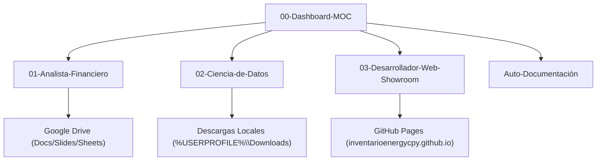

# 🧠 Bóveda de Agentes Antigravity IDE - Map of Content (MOC)

Bienvenido a la Bóveda de Obsidian para la gestión estructurada de agentes con habilidades avanzadas. Esta boveda relacional organiza la arquitectura, credenciales, catálogo de habilidades e historial de mejoras continuas de la cuenta **`inventarioenergycpy`**.

---

## 📌 Datos del Entorno
- **Cuenta GitHub**: `inventarioenergycpy`
- **Correo Electrónico**: `inventario.energycpy@gmail.com`
- **Modo de Autenticación**: Inicio directo con Google OAuth.

---

## 🤖 Catálogo de Agentes Especializados

### 1. [[Agentes/01-Analista-Financiero|Analista Financiero de Proyectos de Inversión]]
- **Enfoque**: Evaluación de flujos de caja, VAN, TIR, análisis de riesgo y tendencias de mercado web.
- **Entregables**: Almacenados en Google Drive (`inventario.energycpy@gmail.com`).

### 2. [[Agentes/02-Ciencia-de-Datos|Ciencia de Datos (PySpark, Python, SQL y Power BI)]]
- **Enfoque**: Procesamiento masivo de datos, optimización SQL y proyectos Power BI Project (`.pbip`).
- **Entregables**: Guardados localmente en `%USERPROFILE%\Downloads`.

### 3. [[Agentes/03-Desarrollador-Web-Showroom|Desarrollador Web Showroom]]
- **Enfoque**: Maquetación de showrooms interactivos de proyectos de inversión (inspirado en `desarrollosas.com.ar`).
- **Entregables**: Código maquetado en `showroom-web/` listo para GitHub Pages.

---

## ⚙️ Sincronización Multi-PC y Utilidades
- **Script de Menú Interactivo**: `[[scripts/start.ps1]]`
- **Inicialización de Entorno**: `[[scripts/setup_environment.ps1]]`
- **Sincronización Git**: `[[scripts/sync_repository.ps1]]`

---

## 📜 Historial de Mejoras Continuas
- [[Historial-Mejoras/00-Registro-Inicial|00-Registro Inicial de Arquitectura]]
