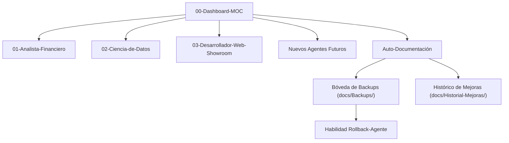

# 🧠 Bóveda de Agentes Antigravity IDE - Map of Content (MOC)

Bienvenido a la Bóveda de Obsidian para la gestión estructurada de agentes con habilidades avanzadas, **soporte para nuevos perfiles futuros**, **historial de evoluciones** y **sistema de resguardo/rollback preventivo**.

---

## 📌 Datos del Entorno
- **Cuenta GitHub**: `inventarioenergycpy`
- **Correo Electrónico**: `inventario.energycpy@gmail.com`
- **Modo de Autenticación**: Inicio directo con Google OAuth.

---

## 🤖 Arquitectura del Sistema de Agentes y Resguardo

---

## 📂 Áreas de la Bóveda Obsidian

### 1. [[Agentes/01-Analista-Financiero|Analista Financiero]]
- **Entregables**: Google Drive (`inventario.energycpy@gmail.com`).

### 2. [[Agentes/02-Ciencia-de-Datos|Ciencia de Datos]]
- **Entregables**: Carpetas locales `%USERPROFILE%\Downloads` (Power BI `.pbip`).

### 3. [[Agentes/03-Desarrollador-Web-Showroom|Desarrollador Web Showroom]]
- **Entregables**: Showroom maquetado en `showroom-web/` listo para GitHub Pages.

---

## 🛡️ Sistema de Seguridad, Histórico y Rollback

1. **Creación de Nuevos Agentes Futuros**:
   - Para agregar un agente en el futuro, crear `.agents/skills/<nuevo-agente>/SKILL.md` y su ficha en `docs/Agentes/`.
2. **Backups Preventivos**:
   - Cada mejora genera automáticamente una copia de respaldo en `[[docs/Backups/README|docs/Backups/]]`.
3. **Registro Histórico**:
   - Cada cambio queda registrado cronológicamente en `docs/Historial-Mejoras/`.
4. **Capacidad de Rollback / Reversión**:
   - Si un cambio no resulta satisfactorio, la habilidad `rollback-agente` restaura cualquier versión anterior almacenada en `docs/Backups/`.

---

## 📜 Historial de Mejoras Continuas
- [[Historial-Mejoras/00-Registro-Inicial|00-Registro Inicial de Arquitectura]]
- [[Historial-Mejoras/2026-08-12_desarrollador-web-showroom_maquetacion-energy-cpy|2026-08-12 Desarrollador Web Showroom — Maquetación Benchmark Energy CPY]]
- [[Historial-Mejoras/2026-08-12_desarrollador-web-showroom_buenas-practicas-github|2026-08-12 Desarrollador Web Showroom — Integración de Buenas Prácticas Oficiales de GitHub]]

