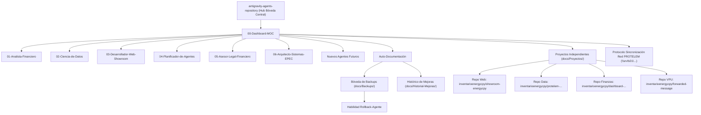

# 🌐 Bóveda de Agentes Antigravity IDE - Map of Content (MOC)

Bienvenido a la Bóveda de Obsidian para la gestión estructurada de agentes con habilidades avanzadas, **soporte para nuevos perfiles futuros**, **historial de evoluciones** y **sistema de resguardo/rollback preventivo**.

---

## 📌 Datos del Entorno
- **Cuenta GitHub**: `inventarioenergycpy`
- **Correo Electrónico**: `inventario.energycpy@gmail.com`
- **Modo de Autenticación**: Inicio directo con Google OAuth.
- **Protocolo de Desarrollo**: **Metodología Estandarizada en 6 Etapas** aplicada al 100% de las habilidades (`Investigación en Fuentes Confiables -> Diseño & Tesis -> Pruebas Parciales -> Prueba Piloto con Aprobación -> Pruebas Finales -> Auto-Documentación & Bóveda Obsidian`).

---

## 🏗️ Arquitectura del Sistema de Agentes y Repositorios Dedicados

---

## 📚 Áreas de la Bóveda Obsidian

### 1. [[Agentes/01-Analista-Financiero|Analista Financiero]]
- **Entregables**: Google Drive (`inventario.energycpy@gmail.com`) / Repositorios Financieros Dedicados.

### 2. [[Agentes/02-Ciencia-de-Datos|Ciencia de Datos (PySpark, Python, SQL, Power BI TMDL & Reglas BI EPEC)]]
- **Entregables**: Descargas / Repositorios de Datos / Motor Text-to-SQL / Diccionario 505 QVDs Qlik Sense / Reglas BI Normativa EPEC.

### 3. [[Agentes/03-Desarrollador-Web-Showroom|Desarrollador Web Showroom e Informes Técnicos]]
- **Entregables**: Repositorios Web Dedicados en GitHub (`inventarioenergycpy/<proyecto-web>`) / Sitios Estáticos de Reportes HTML.

### 4. [[Agentes/04-Planificador-Disenador-de-Agentes|Planificador y Diseñador de Agentes AI]]
- **Entregables**: Investigación verídica, diseño pre-implementación, roadmap de pruebas parciales, pruebas piloto y auto-documentación de nuevos agentes.

### 5. [[Agentes/05-Asesor-Legal-Financiero|Asesor Legal en Intermediación Financiera y Regulación Energética]]
- **Entregables**: Estrategia documental en 3 capas, NCNDA, corretaje con overprice, mandatos, fee sharing, Reglamento EPEC en Google Drive (`inventario.energycpy@gmail.com`).

### 6. [[Agentes/06-Arquitecto-Sistemas-EPEC|Arquitecto de Sistemas EPEC (CIS / MDM / Licitaciones)]]
- **Entregables**: Arquitectura de Sistemas Comerciales, seguimiento de pliegos licitatorios (929 requerimientos en 35 grupos), benchmarking de proveedores (Oracle C2M/CCS, OPEN, PRETECO/ESC) en Bóveda Central y repositorios dedicados.

### 7. [[Protocolo-Sincronizacion-Red-PROTELEM|Protocolo Operativo de Sincronización Red PROTELEM (\\srvfs01\...)]]
- **Habilidad**: `.agents/skills/sincronizacion-red-protelem/SKILL.md`
- **Propósito**: Sincronizar automáticamente cualquier nueva documentación o proyecto guardado en la red `\\srvfs01\ProyectoTelemedicion\Documentación\PROTELEM\PROJECTS` hacia la Bóveda Central con backups preventivos `.bak` y sin pérdida de información.

### 8. [[Proyectos/README|Índice de Proyectos e Repositorios Dedicados]]
- Fichas técnicas, enlaces a repositorios remotos y URLs live de cada proyecto desarrollado por los agentes.

---

## 🔒 Sistema de Seguridad, Histórico y Rollback

1. **Creación de Nuevos Agentes Futuros**:
   - Para agregar un agente en el futuro, crear `.agents/skills/<nuevo-agente>/SKILL.md` y su ficha en `docs/Agentes/`.
2. **Backups Preventivos**:
   - Cada mejora genera automáticamente una copia de respaldo en `[[docs/Backups/README|docs/Backups/]]`.
3. **Registro Histórico**:
   - Cada cambio queda registrado cronológicamente en `docs/Historial-Mejoras/`.
4. **Capacidad de Rollback / Reversión**:
   - Si un cambio no resulta satisfactorio, la habilidad `rollback-agente` restaura cualquier versión anterior almacenada en `docs/Backups/`.

---

## 📜 Historial de Mejoras Continuas
- [[Historial-Mejoras/00-Registro-Inicial|00-Registro Inicial de Arquitectura]]
- [[Historial-Mejoras/2026-08-12_desarrollador-web-showroom_maquetacion-energy-cpy|2026-08-12 Desarrollador Web Showroom — Maquetación Benchmark Energy CPY]]
- [[Historial-Mejoras/2026-08-12_desarrollador-web-showroom_buenas-practicas-github|2026-08-12 Desarrollador Web Showroom — Integración de Buenas Prácticas Oficiales de GitHub]]
- [[Historial-Mejoras/2026-08-14_protocolo-multi-repositorio-proyectos|2026-08-14 Redefinición Bóveda Central de Agentes 100% y Protocolo Multi-Repositorio por Proyecto]]
- [[Historial-Mejoras/2026-08-14_registro-agente-planificador|2026-08-14 Creación e Integración del Agente Planificador y Diseñador de Agentes AI]]
- [[Historial-Mejoras/2026-08-14_estandarizacion-estricta-protocolo-6-etapas|2026-08-14 Estandarización Secuencial del Protocolo de 6 Etapas en todas las Skills]]
- [[Historial-Mejoras/2026-08-20_ciencia-de-datos_ingenieria-inversa-pbip-tmdl|2026-08-20 Ciencia de Datos — Integración de Estrategias de Ingeniería Inversa y Documentación TMDL / PBIP]]
- [[Historial-Mejoras/2026-08-21_registro-agente-legal-financiero|2026-08-21 Asesor Legal en Intermediación Financiera — Integración de Estrategia Documental en 3 Capas y Marco CCCN/ICC]]
- [[Historial-Mejoras/2026-08-23_desarrollo-dashboard-gestion-intermediacion|2026-08-23 Desarrollo y Despliegue del Dashboard de Gestión e Intermediación Financiera con Matriz Legal en 3 Capas]]
- [[Historial-Mejoras/2026-08-27_dashboard_importador-excel-dinamico-diff-rollback|2026-08-27 Plantillas Excel Dinámicas Adaptables, Motor de Diff Visual, Cargas Parciales y Rollback]]
- [[Historial-Mejoras/2026-08-28_desarrollador-web-showroom_mejoras-estrategicas-showroom|2026-08-28 Desarrollador Web Showroom — Selector Bilingüe, Filtros Desde-Hasta, Ruteo Silencioso y Gestión de Estados]]
- [[Historial-Mejoras/2026-09-02_protelem_integracion-conocimiento-y-nuevo-agente-arquitecto|2026-09-02 Integración de Conocimiento Red PROTELEM y Creación del Agente 6: Arquitecto de Sistemas EPEC]]
- [[Configuracion-Credenciales-GitHub|Configuración y Resguardo de Credenciales GitHub PAT]]

---

## 🚀 Proyectos y Soluciones en Repositorios Dedicados
- [[Proyectos/2026-08-14_showroom-energycpy|2026-08-14 Showroom Energy CPY (Web Showroom Benchmark)]]
- [[Proyectos/2026-08-20_protelem-indicadores-gerencia-comercial|2026-08-20 PROTELEM - Indicadores Gerencia Comercial (Documentación & Arquitectura Semántica)]]
- [[Proyectos/2026-08-23_dashboard-gestion-intermediacion|2026-08-23 Dashboard de Gestión e Intermediación Financiera con Matriz Legal en 3 Capas]]
- [[Proyectos/2026-09-02_forwarded-message|2026-09-02 Proyecto Forwarded Message (Green Hydrogen & Solar Hub - VPU Fideicomiso)]]
- [[Proyectos/2026-09-02_protelem-conocimiento-integrado|2026-09-02 Compendio Integrado de Conocimiento Red PROTELEM (5 Proyectos EPEC)]]
