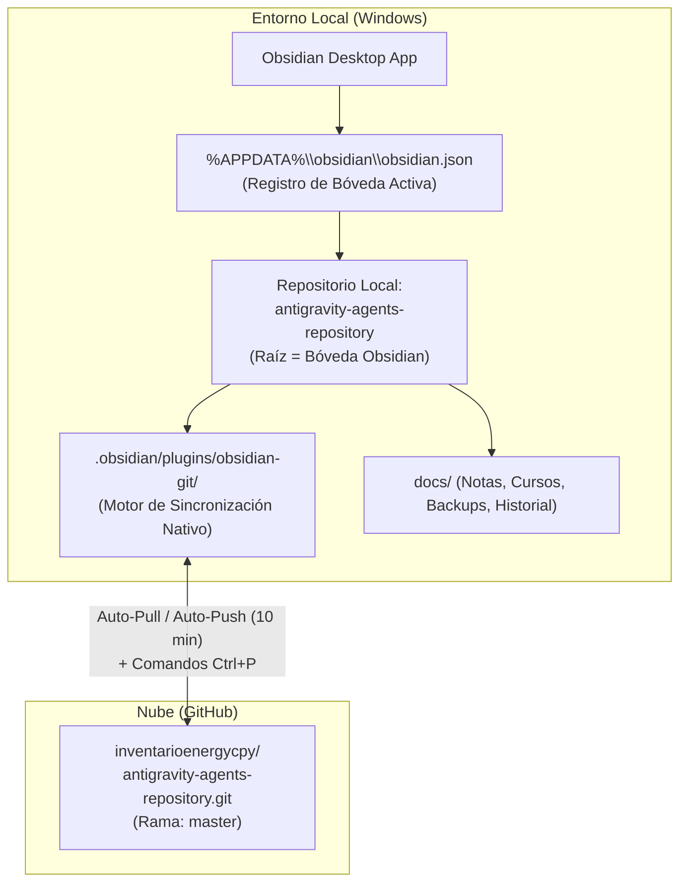

# 💎 Protocolo Operativo: Sincronización de Obsidian con el Repositorio Central GitHub

Este documento formaliza el protocolo técnico, las configuraciones realizadas y la guía de replicación para visualizar y mantener sincronizada la Bóveda de **Obsidian** con el repositorio remoto de GitHub:
👉 [`https://github.com/inventarioenergycpy/antigravity-agents-repository.git`](https://github.com/inventarioenergycpy/antigravity-agents-repository.git)

---

## 📌 1. Arquitectura de Integración y Almacenamiento

La integración opera en dos niveles complementarios:



---

## ⚙️ 2. Configuraciones Técnicas Realizadas

### A. Registro Global de la Bóveda (`%APPDATA%\obsidian\obsidian.json`)
Permite que la aplicación Obsidian abra automáticamente el repositorio central como bóveda activa al iniciarse:

```json
{
  "vaults": {
    "21370a6259624e48": {
      "path": "C:\\Users\\Usuario\\.gemini\\antigravity-ide\\scratch\\antigravity-agents-repository",
      "ts": 1790775873130,
      "open": true
    }
  },
  "insider": false
}
```

### B. Habilitación de Plugins Comunitarios (`.obsidian/community-plugins.json`)
Declara los plugins de terceros autorizados para ejecutarse en la bóveda:

```json
[
  "obsidian-git"
]
```

### C. Parámetros del Plugin `obsidian-git` (`.obsidian/plugins/obsidian-git/data.json`)
Parametrización para garantizar sincronización bidireccional transparente y sin intervención manual obligatoria:

```json
{
  "autoSaveInterval": 10,
  "autoPushInterval": 10,
  "autoPullInterval": 10,
  "autoPullOnBoot": true,
  "disablePush": false,
  "pullBeforePush": true,
  "showStatus": true,
  "gitPath": "",
  "customMessage": "vault backup: {{date}}",
  "showStatusBar": true,
  "updateSubmodules": false,
  "syncMethod": "merge",
  "lineAuthor": false
}
```

* **`autoPullOnBoot: true`**: Al abrir Obsidian, descarga inmediatamente las últimas notas, cursos y mejoras agregadas por los agentes en GitHub.
* **`autoSaveInterval: 10` & `autoPushInterval: 10`**: Cada 10 minutos confirma y sube a GitHub todos los cambios locales.
* **`pullBeforePush: true`**: Protege la integridad del repositorio descargando cambios remotos antes de enviar nuevos commits.
* **`showStatusBar: true`**: Proporciona visualización en tiempo real del estado de Git (icono y contador de cambios) en la esquina inferior de Obsidian.

### D. Preferencias de la Bóveda (`.obsidian/app.json`)
Asegura compatibilidad absoluta con enlaces estándar de Markdown y estructura organizada:

```json
{
  "useMarkdownLinks": true,
  "newFileLocation": "folder",
  "newFileFolderPath": "docs",
  "attachmentFolderPath": "docs/assets",
  "promptDelete": false,
  "showLineNumber": true,
  "livePreview": true,
  "alwaysUpdateLinks": true
}
```

---

## 💻 3. Guía de Replicación Rápida Multi-PC (1 Clic)

Cuando se inicie sesión en una nueva computadora o partición, se puede replicar la vinculación ejecutando en PowerShell:

```powershell
# 1. Clonar o sincronizar repositorio central
git clone https://github.com/inventarioenergycpy/antigravity-agents-repository.git
cd antigravity-agents-repository

# 2. Habilitar compatibilidad con rutas largas en Windows
git config core.longpaths true

# 3. Registrar automáticamente la Bóveda en Obsidian
python -c "import os, json, hashlib, time; repo=os.path.abspath('.'); appdata=os.environ.get('APPDATA',''); ob_dir=os.path.join(appdata,'obsidian'); os.makedirs(ob_dir, exist_ok=True); vid=hashlib.md5(repo.encode()).hexdigest()[:16]; cfg=os.path.join(ob_dir,'obsidian.json'); data=json.load(open(cfg)) if os.path.exists(cfg) else {'vaults':{}}; data['vaults'][vid]={'path':repo,'ts':int(time.time()*1000),'open':True}; json.dump(data, open(cfg,'w'), indent=2); print('Boveda Obsidian Registrada:', repo)"
```

---

## ⌨️ 4. Uso Diario y Atajos en Obsidian

| Acción | Atajo / Procedimiento | Efecto |
| :--- | :--- | :--- |
| **Sincronizar Manualmente (Pull)** | `Ctrl + P` ➔ Escribir `Git: Pull` | Descarga de inmediato cualquier cambio desde GitHub. |
| **Hacer Backup / Push Manual** | `Ctrl + P` ➔ Escribir `Git: Create backup` | Empaqueta, commitea y sube los cambios actuales a GitHub. |
| **Ver Panel de Control Git** | `Ctrl + P` ➔ Escribir `Git: Open Source Control View` | Muestra lista de archivos modificados, staged y diffs. |
| **Abrir Tablero Principal** | `Ctrl + O` ➔ `00-Dashboard-MOC` | Abre el mapa central de contenidos de la bóveda. |
| **Catálogo de Cursos** | `Ctrl + O` ➔ `00-Indice-General-Cursos` | Accede al compendio de videos y diplomaturas. |

---

## 🛡️ 5. Manejo de Errores y Contingencias

1. **Error de Rutas Largas en Windows (`Filename too long`)**:
   - Solución: Ejecutar `git config core.longpaths true` en la raíz del repositorio.
2. **Autenticación Git / Permisos Remotos**:
   - Las credenciales se gestionan a través de Git Credential Manager vinculado a la cuenta `inventarioenergycpy` o según el protocolo en [[Configuracion-Credenciales-GitHub]].
3. **Conflictos de Fusión**:
   - `obsidian-git` está configurado con `syncMethod: "merge"`, permitiendo resolver discrepancias línea a línea sin sobrescribir información.

---

## 🔗 Enlaces Relacionales
- [[00-Dashboard-MOC|Tablero Central MOC]]
- [[Configuracion-Credenciales-GitHub|Configuración Segura de Credenciales GitHub]]
- [[Protocolo-Sincronizacion-Red-PROTELEM|Protocolo Sincronización Red PROTELEM]]
- [[Agentes/07-Procesador-Cursos-YouTube|Agente 07: Procesador de Cursos YouTube]]
