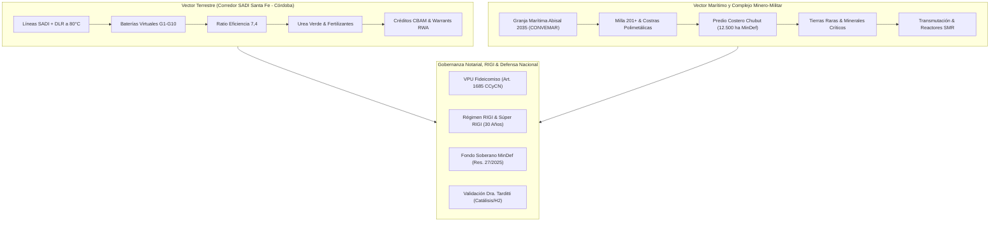

# ⚡ Ficha de Proyecto: Forwarded Message (Proyecto Trono Raíz 2035)

- **Repositorio Dedicado**: [`https://github.com/inventarioenergycpy/forwarded-message`](https://github.com/inventarioenergycpy/forwarded-message)
- **Agente Responsable**: `[[docs/Agentes/01-Analista-Financiero|01 - Analista Financiero & Modelador Económico]]`
- **Vehículo de Propósito Único (VPU)**: Fideicomiso de Estructuración Financiera (Art. 1685 CCyCN) tramitado ante autoridades provinciales de Santa Fe (Expte. `EE-2026-00014511-APPSF-PE`) y Córdoba (`SUAC 0465-993111026`).
- **Escrituras Públicas Matrices**:
  - **Escritura Pública Nº 65** (29/04/2026): Afectación fiduciaria del *Capital SISTEMA*, servidumbres de electroducto (Ley 19.552) y Camino de Sirga (15 m).
  - **Primer Testimonio - Escritura Pública Nº 83** (03/06/2026): Adenda Complementaria Particular y Reglas de Gobierno (Esc. Alejandro J. Carranza Yofre - Reg. Notarial 726).

---

## 🧭 Arquitectura Bimodal del Proyecto

---

## 🏛️ Componentes Estratégicos Incorporados (Escrituras 65 y 83)

### 1. Granja Marítima Abisal 2035 y CONVEMAR (Milla 201+)
- Monetización de los derechos soberanos otorgados por la **CONVEMAR** al Estado Nacional hace 31 años sobre el lecho y subsuelo marítimo.
- Muestreo y prospección georreferenciada con drones y vehículos submarinos autónomos (ROVs) de costras polimetálicas ricas en cobalto, níquel, telurio y manganeso.

### 2. Predio Costero Militar de Chubut (12.500 Hectáreas)
- Constitución de **Derecho Real de Superficie** (arts. 2114 a 2128 del Código Civil y Comercial) sobre el predio fiscal de defensa en la Provincia del Chubut.
- Destino: Polo de acopio, telecomunicaciones, refinación y valorización de minerales estratégicos y tierras raras bajo régimen RIGI.

### 3. Activos Intangibles bajo Secreto Industrial (Ley 24.766)
- **Matriz de Simulación Térmica y Balance Exergético ($1450^\circ\text{C} \pm 15^\circ\text{C}$)** y Certificación de Huella Térmica (CHT).
- **Ecosistema de Baterías Virtuales G1 a G10**: Algoritmos MPC, aislamiento de flujo atómico G9 y tokenización financiera G10.
- **Licencia Ejecutable Cifrada de Caja Negra**: Explotación tecnológica sin entrega de código fuente.
- **Mutación Algorítmica con Acople Nuclear**: Evolución de carga base soportada por reactores modulares (**SMR**).

### 4. Fondo de Fortalecimiento para la Defensa y Soberanía
- Asignación específica de fondos extraída directamente de las utilidades del Holding promotor y destinada exclusivamente al **Ministerio de Defensa (Resolución MinDef 27/2025)**.
- Financiamiento del patrullaje marítimo de la Armada Argentina en la Milla 201+ y la modernización logística de las reservas militares en tierra en Chubut.

---

## 📊 Métricas Financieras Consolidadas

| Métrica Financiera | Valor Consolidado |
| :--- | :--- |
| **Inversión CAPEX Inicial (Hito 0,5 MW)** | US$ 16,5 Millones |
| **Inversión CAPEX Total Progresiva (13.500 MW + Chubut)** | US$ 1.735,0 Millones |
| **Margen EBITDA Operativo en Régimen** | > 80% sostenido |
| **Valor Actual Neto (VAN a 10 Años - WACC 9,5%)** | **US$ 1.842,5 Millones** |
| **Valor Actual Neto (VAN a 30 Años - Régimen RIGI)** | **US$ 5.120,0 Millones** |
| **Tasa Interna de Retorno (TIR Anual en US$)** | **38,6%** |
| **Período de Recupero (Payback Descontado)** | **4,8 Años** |

---

## 🔒 Doble Escudo Notarial y Jurisdicción Arbitral

1. **Fondo y Materia Económica**: Arbitraje de Derecho ante la **Cámara de Comercio Internacional (CCI / ICC) en Nueva York** bajo las reglas del RIGI (Ley 27.742) y la Convención de Nueva York de 1958.
2. **Urgencia Territorial**: Medidas cautelares expeditas de preservación de traza y despeje de electroducto en los tribunales locales de Santa Fe y Córdoba.
3. **Inmunidad de Flujos**: Preeminencia federal ratificada por la Corte Suprema de Justicia de la Nación (**Fallo "TGS c/ Provincia de Santa Cruz"**) blindando el CBU US$ frente a embargos provinciales o municipales.

---

## 📚 Enlaces y Referencias en la Bóveda

- [[00-Dashboard-MOC]]
- [[docs/Agentes/01-Analista-Financiero]]
- [[docs/Agentes/05-Asesor-Legal-Financiero]]
- [[docs/Configuracion-Credenciales-GitHub]]
