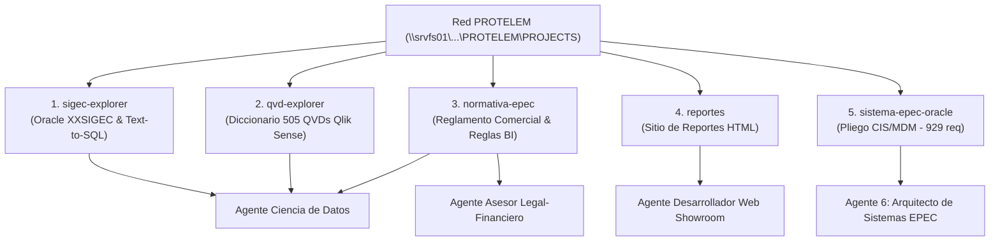

---
type: proyecto
proyecto: "Conocimiento Integrado Red PROTELEM"
agentes_responsables:
  - "[[docs/Agentes/02-Ciencia-de-Datos|Ciencia de Datos]]"
  - "[[docs/Agentes/06-Arquitecto-Sistemas-EPEC|Arquitecto de Sistemas EPEC]]"
  - "[[docs/Agentes/05-Asesor-Legal-Financiero|Asesor Legal en Intermediación Financiera]]"
  - "[[docs/Agentes/03-Desarrollador-Web-Showroom|Desarrollador Web Showroom]]"
fuente_red: "\\srvfs01\ProyectoTelemedicion\Documentación\PROTELEM\PROJECTS"
fecha_integracion: 2026-09-02
tags:
  - #proyecto
  - #protelem
  - #epec
  - #sigec
  - #qvd
  - #normativa-epec
  - #reportes
  - #sistema-epec-oracle
  - #obsidian
---

# Proyecto: Compendio Integrado de Conocimiento Red PROTELEM (EPEC)

## 📌 1. Resumen Ejecutivo y Origen de los Datos
Este documento constituye la síntesis y preservación al 100% del corpus de conocimiento acumulado por el equipo técnico en la carpeta de red `\\srvfs01\ProyectoTelemedicion\Documentación\PROTELEM\PROJECTS`. 

El conocimiento se estructura en **5 grandes proyectos interconectados en formato Bóveda de Obsidian**, integrados formalmente en las habilidades del ecosistema de agentes **`antigravity-agents-repository`**.

---

## 🔍 2. Desglose de Proyectos y Dominios Técnicos

---

### 1. `sigec-explorer` (Explorador del Sistema Comercial SIGEC & Text-to-SQL)
- **Propósito**: Segundo cerebro y herramienta de exploración del esquema Oracle `XXSIGEC` (+500 tablas comerciales) con motor **Text-to-SQL**.
- **Fase 1 - Catálogo de Esquema**:
  - `oracle_db.py`: Conector seguro `OracleReadOnly`.
  - `catalog_builder.py`: Extracción del diccionario Oracle hacia `catalog.json`.
  - `synonyms.json`: Diccionario configurable usuario ➔ esquema (ej. *"medidas"* ➔ `LECTURAS`, `CABEZA_LECTURAS`).
  - Frontend en FastAPI para exploración en navegador sin tocar la base de producción.
- **Fase 2 - Motor Text-to-SQL**:
  - *Flujo*: Expansión de Tokens (retriever) ➔ Inverted Index sobre `catalog.json` (corte máx 8 tablas) ➔ Generación SQL vía LLM Claude ➔ Validación sintáctica (`sql_validator.py` con blacklist de seguridad) ➔ Confirmación previa en UI antes de ejecutar.
- **Modelo de Negocio e Ilícitos**:
  - Modelo de facturación, tarifas vigentes, clases comerciales y frontera legal de actas/legajos de ilícitos.

---

### 2. `qvd-explorer` (Diccionario de QVDs de Qlik Sense)
- **Propósito**: Catálogo navegable de **505 archivos QVD** accesibles desde el Editor de carga de datos de Qlik Sense (EPEC).
- **Procesamiento Autogenerado**:
  - Generado mediante el scraper `qs-scrapping` (`python main.py vault` ➔ `qvd_dictionary.json`).
  - Mapeo de columnas, tipos inferidos y ejemplos con cruces hacia las tablas de origen en `XXSIGEC`.
- **Sensibilidad de Datos**: Clasificación confidencial por datos reales de clientes en ejemplos.

---

### 3. `normativa-epec` (Reglamento Comercial & Reglas de Negocio EPEC)
- **Propósito**: Corpus conceptual canónico de las reglas del negocio de EPEC (Reglamento de Comercialización de la Energía Eléctrica).
- **Reglas BI para Ciencia de Datos**:
  - *Tipos de Suministro*: Definitivos (principales, auxiliares, estacionales, condicionales) y Transitorios (obradores, eventos, móviles).
  - *Demandas y Potencia*: Reglas para demandas máximas leídas/facturadas, factor de potencia, recargos y categorías tarifarias.
  - *Facturación, Mora e Ilícitos*: Suspensión de servicio, cobros, actas de constatación de ilícitos, liquidación de energía no registrada y recupero.
  - *Obras y Contribuciones*: Régimen de aportes reembolsables, contribuciones financieras y servidumbres de electroducto.

---

### 4. `reportes` (Sitio Interno de Informes Técnicos HTML)
- **Propósito**: Sitio estático para publicar informes técnicos como páginas HTML autónomas servidas dentro de la red interna de EPEC.
- **Trazabilidad de Informes**:
  - Eliminación de archivos sueltos por correo electrónico mediante asignación de **URLs estables por informe**.
  - Convención de publicación y estructura de carpetas sin backend ni base de datos.
  - Caso de origen: Expediente de la Cooperativa de Villa General Belgrano.

---

### 5. `sistema-epec-oracle` (Licitación del Nuevo Sistema Comercial EPEC)
- **Propósito**: Análisis y seguimiento documental del pliego de licitación del nuevo sistema comercial y de facturación de EPEC (CIS – MDM – WFM – CRM – CX – Portal – Motor IA).
- **Volumen de Requerimientos**:
  - **929 requerimientos transcriptos** distribuidos en **35 grupos del Anexo**.
  - Matriz de gobernanza y trazabilidad entre versiones de pliegos.
- **Plataformas Evaluadas**:
  - **Oracle Utilities (C2M / CCS)**.
  - **OPEN (SmartFlex)**.
  - **PRETECO / ESC Partners**.
- **Asignación Especial**: Atendido de forma dedicada por el **Agente 6: Arquitecto de Sistemas EPEC** (`arquitecto-sistemas-epec`).

---

## 👥 3. Asignación de Habilidades y Agentes

| Proyecto PROTELEM | Agente Especialista Asignado | Skill / Habilidad Actualizada |
| :--- | :--- | :--- |
| `sigec-explorer` | [[docs/Agentes/02-Ciencia-de-Datos\|Ciencia de Datos]] | `.agents/skills/ciencia-de-datos/SKILL.md` |
| `qvd-explorer` | [[docs/Agentes/02-Ciencia-de-Datos\|Ciencia de Datos]] | `.agents/skills/ciencia-de-datos/SKILL.md` |
| `normativa-epec` (Reglas BI) | [[docs/Agentes/02-Ciencia-de-Datos\|Ciencia de Datos]] | `.agents/skills/ciencia-de-datos/SKILL.md` |
| `normativa-epec` (Marco Legal) | [[docs/Agentes/05-Asesor-Legal-Financiero\|Asesor Legal Financiero]] | `.agents/skills/asesor-legal-financiero/SKILL.md` |
| `reportes` | [[docs/Agentes/03-Desarrollador-Web-Showroom\|Desarrollador Web Showroom]] | `.agents/skills/desarrollador-web-showroom/SKILL.md` |
| `sistema-epec-oracle` | ✨ [[docs/Agentes/06-Arquitecto-Sistemas-EPEC\|Arquitecto Sistemas EPEC]] | `.agents/skills/arquitecto-sistemas-epec/SKILL.md` |

---

## 🔒 4. Preservación y Resguardos

- Copias preventivas `.bak` generadas en `docs/Backups/` antes de editar cualquier habilidad existente.
- Sincronización remota asegurada mediante `git push` a `https://github.com/inventarioenergycpy/antigravity-agents-repository.git`.
