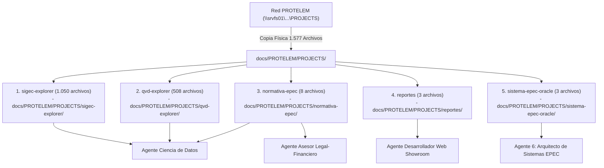

---
type: proyecto
proyecto: "Conocimiento Integrado Red PROTELEM"
agentes_responsables:
  - "[[docs/Agentes/02-Ciencia-de-Datos|Ciencia de Datos]]"
  - "[[docs/Agentes/06-Arquitecto-Sistemas-EPEC|Arquitecto de Sistemas EPEC]]"
  - "[[docs/Agentes/05-Asesor-Legal-Financiero|Asesor Legal en Intermediación Financiera]]"
  - "[[docs/Agentes/03-Desarrollador-Web-Showroom|Desarrollador Web Showroom]]"
fuente_red: "\\srvfs01\ProyectoTelemedicion\Documentación\PROTELEM\PROJECTS"
carpeta_copia_replica: "docs/PROTELEM/PROJECTS/"
archivos_copiados_totales: 1577
fecha_integracion: 2026-09-02
tags:
  - #proyecto
  - #protelem
  - #epec
  - #sigec
  - #qvd
  - #normativa-epec
  - #reportes
  - #sistema-epec-oracle
  - #obsidian
---

# Proyecto: Compendio Integrado de Conocimiento Red PROTELEM (EPEC)

## 📌 1. Resumen Ejecutivo y Réplica Física de Datos
Este documento constituye la síntesis y la **réplica física exacta (1.577 archivos copiados)** de la documentación acumulada por el equipo técnico en la carpeta de red `\\srvfs01\ProyectoTelemedicion\Documentación\PROTELEM\PROJECTS`.

Todos los archivos, notas `.md`, índices y configuraciones de Obsidian se encuentran **físicamente copiados y respaldados** dentro del repositorio central en:
`D:\Proyectos\antigravity-agents-repository\docs\PROTELEM\PROJECTS\`

---

## 🔍 2. Desglose de Proyectos y Rutas de Archivos Físicos Copiados

---

### 1. `sigec-explorer` (1.050 archivos copiados)
- **Ruta Física Interna**: [`docs/PROTELEM/PROJECTS/sigec-explorer/`](file:///D:/Proyectos/antigravity-agents-repository/docs/PROTELEM/PROJECTS/sigec-explorer/)
- **Punto de Entrada Obsidian**: [[PROTELEM/PROJECTS/sigec-explorer/_index|Home SIGEC Explorer]]
- **Contenido Copiado**: Catálogo completo de más de 500 tablas del esquema Oracle `XXSIGEC` (en `tablas/`), arquitectura del motor Text-to-SQL (`Arquitectura.md`, `Chat Texto-a-SQL.md`), modelo de facturación, legajos ilícitos, glosario de negocio y decisiones.

---

### 2. `qvd-explorer` (508 archivos copiados)
- **Ruta Física Interna**: [`docs/PROTELEM/PROJECTS/qvd-explorer/`](file:///D:/Proyectos/antigravity-agents-repository/docs/PROTELEM/PROJECTS/qvd-explorer/)
- **Punto de Entrada Obsidian**: [[PROTELEM/PROJECTS/qvd-explorer/_index|Home QVD Explorer]]
- **Contenido Copiado**: Diccionario completo de 505 QVDs accesibles desde Qlik Sense (en `qvds/`), catálogo navegable, seguridad y cruces de linaje de datos hacia Oracle `XXSIGEC`.

---

### 3. `normativa-epec` (8 archivos copiados)
- **Ruta Física Interna**: [`docs/PROTELEM/PROJECTS/normativa-epec/`](file:///D:/Proyectos/antigravity-agents-repository/docs/PROTELEM/PROJECTS/normativa-epec/)
- **Punto de Entrada Obsidian**: [[PROTELEM/PROJECTS/normativa-epec/_index|Home Normativa EPEC]]
- **Contenido Copiado**: Reglamento de Comercialización de la Energía Eléctrica EPEC completo (`Definiciones y glosario.md`, `Demandas de potencia.md`, `Facturacion y cobranza.md`, `Ilicitos y recupero de energia.md`, `Medicion de consumos.md`, `Obras y contribuciones financieras.md`, `Otorgamiento y obligaciones.md`).

---

### 4. `reportes` (3 archivos copiados)
- **Ruta Física Interna**: [`docs/PROTELEM/PROJECTS/reportes/`](file:///D:/Proyectos/antigravity-agents-repository/docs/PROTELEM/PROJECTS/reportes/)
- **Punto de Entrada Obsidian**: [[PROTELEM/PROJECTS/reportes/_index|Home Reportes]]
- **Contenido Copiado**: Convención de publicación de informes técnicos en HTML estático (`Convención de publicación.md`, `Seguridad.md`).

---

### 5. `sistema-epec-oracle` (3 archivos copiados)
- **Ruta Física Interna**: [`docs/PROTELEM/PROJECTS/sistema-epec-oracle/`](file:///D:/Proyectos/antigravity-agents-repository/docs/PROTELEM/PROJECTS/sistema-epec-oracle/)
- **Punto de Entrada Obsidian**: [[PROTELEM/PROJECTS/sistema-epec-oracle/_index|Home Sistema EPEC Oracle]]
- **Contenido Copiado**: Documentación de seguimiento de licitación del nuevo sistema comercial CIS/MDM/WFM/CRM (929 requerimientos en 35 grupos), fuentes de información y modelo de seguridad.

---

## 👥 3. Asignación de Habilidades y Agentes

| Proyecto PROTELEM | Agente Especialista Asignado | Skill / Habilidad Actualizada |
| :--- | :--- | :--- |
| `sigec-explorer` | [[docs/Agentes/02-Ciencia-de-Datos\|Ciencia de Datos]] | `.agents/skills/ciencia-de-datos/SKILL.md` |
| `qvd-explorer` | [[docs/Agentes/02-Ciencia-de-Datos\|Ciencia de Datos]] | `.agents/skills/ciencia-de-datos/SKILL.md` |
| `normativa-epec` (Reglas BI) | [[docs/Agentes/02-Ciencia-de-Datos\|Ciencia de Datos]] | `.agents/skills/ciencia-de-datos/SKILL.md` |
| `normativa-epec` (Marco Legal) | [[docs/Agentes/05-Asesor-Legal-Financiero\|Asesor Legal Financiero]] | `.agents/skills/asesor-legal-financiero/SKILL.md` |
| `reportes` | [[docs/Agentes/03-Desarrollador-Web-Showroom\|Desarrollador Web Showroom]] | `.agents/skills/desarrollador-web-showroom/SKILL.md` |
| `sistema-epec-oracle` | ✨ [[docs/Agentes/06-Arquitecto-Sistemas-EPEC\|Arquitecto Sistemas EPEC]] | `.agents/skills/arquitecto-sistemas-epec/SKILL.md` |

---

## 🔒 4. Preservación y Resguardos

- Todos los 1.577 archivos residen físicamente en `docs/PROTELEM/PROJECTS/`.
- Sincronización remota asegurada mediante `git push` a `https://github.com/inventarioenergycpy/antigravity-agents-repository.git`.
