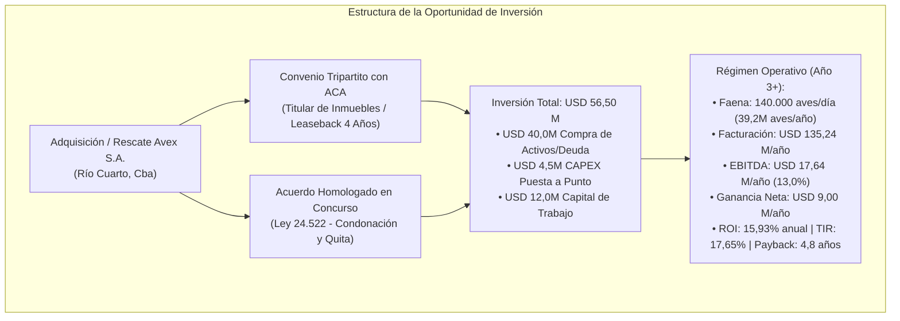

# 🏭 Ficha de Oferta de Inversión: Planta Agroindustrial Avícola Avex S.A.

## 📌 1. Resumen Ejecutivo y Tesis de Oportunidad
Estructuración de propuesta de inversión para la adquisición, rescate operativo y puesta en valor del **Complejo Frigorífico Avícola Avex S.A.** en Reducción / Río Cuarto (Córdoba).
El activo se encuentra en una ventana estratégica de oportunidad por encontrarse su controlante (Grupo Granja Tres Arroyos) en **concurso preventivo de acreedores** (Septiembre 2026) con un pasivo total exigible de **USD 350,9 Millones** y titularidad dominial de los inmuebles transferida fiduciariamente a **ACA (Asociación de Cooperativas Argentinas)** mediante un contrato de *Sale & Leaseback* con opción de rescate/recompra.

---

## 🏛️ 2. Sección 1: Datos Verídicos y Fehacientes (Activo Físico & Legal)

### A. Capacidad y Superficie
* **Predio e Inmuebles**: **200 Hectáreas** de predio fabril en Reducción + **50 Hectáreas** de granjas de reproducción e incubación en San Basilio y Chaján.
* **Superficie Cubierta**: **13.500 m² cubiertos** de frigorífico clase exportación (habilitado SENASA, China, Unión Europea, Sudáfrica y Medio Oriente).
* **Capacidad Nominal de Faena**: **160.000 pollos/día** en 2 turnos.
* **Planta de Alimento Balanceado**: Capacidad de **20 toneladas/hora** con silos de acopio y peletizado.
* **Instalaciones Críticas**: Cámaras de frío continuo, túneles de congelación ultra-rápida IQF, planta de *rendering* para harinas cárnicas/sebo y planta de tratamiento biológico de efluentes.

### B. Antecedentes Societarios y Transaccionales
* **2005-2007**: Fundación por Fernando Ordóñez e inversores privados con financiamiento BID Invest (USD 39M a 50M).
* **2011**: Adquisición por el grupo brasileño **BRF**.
* **Diciembre 2018**: Venta de BRF al consorcio **Granja Tres Arroyos + Fribel S.A.** por **USD 50,0 Millones**.
* **Inicio 2026**: Venta bajo *Sale & Leaseback* a **ACA** con opción de recompra a 4 años.
* **Septiembre 2026**: Apertura del concurso preventivo del grupo con pasivo de **USD 350,9 Millones**.

---

## 📊 3. Sección 2: Modelo Económico-Financiero & Rentabilidad

### A. Indicadores Financieros Clave

| Métrica | Valor Estimado | Notas Técnicas |
|:---|:---:|:---|
| **Valuación de Activos (Cotización Ponderada)** | **USD 44.280.000** | Síntesis ponderada de CRND, Múltiplos M&A y DCF. |
| **Inversión Inicial Total ($I_0$)** | **USD 56.500.000** | USD 40M Activos + USD 4,5M CAPEX + USD 12M Working Capital. |
| **Ingresos Anuales en Régimen (Año 3+)** | **USD 135.240.000** | 39,2M aves/año a USD 3,45/ave (carne + subproductos rendering). |
| **EBITDA Anual en Régimen** | **USD 17.640.000** | Margen EBITDA del 13,04% sobre ventas. |
| **Ganancia Neta Anual (NOPAT)** | **USD 9.000.000** | Resultado limpio tras amortizaciones e Impuesto a las Ganancias (35%). |
| **ROI Contable Anual (en Régimen)** | **15,93% anual** | Ganancia neta sobre capital total invertido. |
| **ROI Contable Promedio (10 Años)** | **14,14% anual** | Promedio anual incluyendo rampa de arranque. |
| **Tasa Interna de Retorno (TIR / IRR)** | **17,65% en USD** | Supera el WACC objetivo (14,25%) en +340 puntos básicos. |
| **Valor Actual Neto (VAN @ 14,25%)** | **USD +11.480.000** | Creación de valor presente neto. |
| **Período de Recupero (Payback)** | **4,8 Años (Simple)** | 6,4 Años en término descontado al WACC. |

---

## ⚖️ 4. Estrategia de Intermediación, Blindaje Legal y Deal Log

1. **Estructura Documental en 3 Capas**:
   - **Capa 1 (NCNDA)**: Acuerdo de confidencialidad y no elusión previo con fondos de inversión compradores/interesados.
   - **Capa 2 (Mandato de Compra/Venta con Overprice)**: Mandato con período de protección (*Tail Period*) de 24 meses y comisión/honorario estructurado.
   - **Capa 3 (Carta de Registro de Inversor / Deal Log)**: Registro formal ante los acreedores, ACA y el juzgado concursal.
2. **Esquema de Entrada**:
   - Opción A: Adquisición de la opción de recompra y cesión del contrato de *Leaseback* ante ACA + adquisición de activos productivos en el concurso.
   - Opción B: Conformación de un fideicomiso o consorcio inversor para cramdown / salvataje en los términos de la Ley 24.522.

---

## 📂 Enlaces y Artefactos Relacionados
* **Informe Técnico Completo**: `[[docs/Agentes/01-Analista-Financiero]]`
* **Tablero Maestro**: `[[00-Dashboard-MOC]]`
